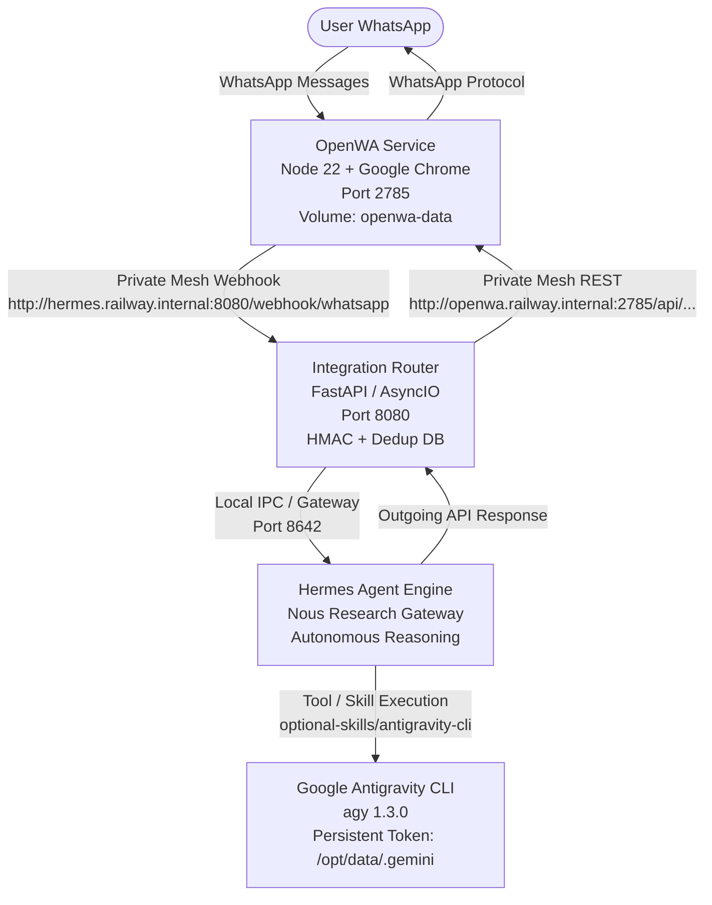

# Hermes Agent + Antigravity Pro + OpenWA Cloud Deployment Guide

## 1. System Architecture



---

## 2. Infrastructure & Service Status

* **Railway Project:** `hermes-whatsapp-agent` (`1d505e90-5a68-45fe-80ab-3f25764df976`)
* **Environment:** `production` (`d9a8774e-4fed-4a10-acea-3db2f5055519`)
* **Hermes Agent Service (`hermes`):**
  * **Status:** `● Online`
  * **Volume:** `hermes-data` mounted at `/opt/data`
  * **Components:**
    * Antigravity CLI (`agy` 1.3.0) installed and available in PATH.
    * Integration Router running on port `8080` with SQLite deduplication database at `/opt/data/router/dedup.db`.
    * Hermes Gateway running on port `8642`.
* **WhatsApp Service (`openwa`):**
  * **Status:** `● Online (QR Code Ready & Waiting for Scan)`
  * **Volume:** `openwa-data` mounted at `/app/data`
  * **Components:**
    * Official `google-chrome-stable` engine.
    * Custom Express bridge with native `@open-wa/wa-automate` client.
    * Webhook forwarder directly to Hermes private mesh.

---

## 3. Step 1: Push Code to GitHub (`adityashah42`)

The entire project is cleanly committed locally on branch `main`.

To create and push the repository to your GitHub account (`adityashah42`):

1. Open your terminal in `c:\Aditya\Alex`.
2. Authenticate with GitHub CLI:
   ```powershell
   gh auth login
   ```
   *(Select `GitHub.com` > `HTTPS` > Log in with a web browser)*
3. Create the remote repository and push in one command:
   ```powershell
   gh repo create adityashah42/hermes-whatsapp-agent --public --source=. --remote=origin --push
   ```

---

## 4. Step 2: Authenticate Antigravity Pro Headless Session

Because Antigravity Pro uses Google OAuth, you need to authenticate once interactively. The credentials will be saved directly into the persistent volume `/opt/data/.gemini`, surviving all future container restarts and redeployments!

In your terminal, connect via SSH into the Hermes container and run the authentication script:

```powershell
railway ssh --service hermes bash scripts/authenticate-antigravity.sh
```

1. The script will output an official Google OAuth authorization URL.
2. Open that URL in your browser and sign in with your Google / Antigravity Pro account.
3. Copy the authorization code and paste it back into the terminal.
4. The script will perform a smoke test turn with `agy` to verify Antigravity Pro capabilities.

---

## 5. Step 3: Pair WhatsApp (OpenWA)

1. Open WhatsApp on your mobile phone.
2. Navigate to **Settings** > **Linked Devices** > **Link a Device**.
3. View the QR code printed in the Railway logs:
   ```powershell
   railway logs --service openwa
   ```
4. Scan the QR code. Once paired, your WhatsApp session token will be saved to `/app/data/`, persisting permanently across container restarts.

---

## 6. Step 4: Configure Allowed Phone Number

To ensure only your authorized WhatsApp number can communicate with Hermes:

```powershell
railway variables --service hermes --set "ALLOWED_WHATSAPP_NUMBERS=+1234567890"
```
*(Replace `+1234567890` with your actual international phone number)*
