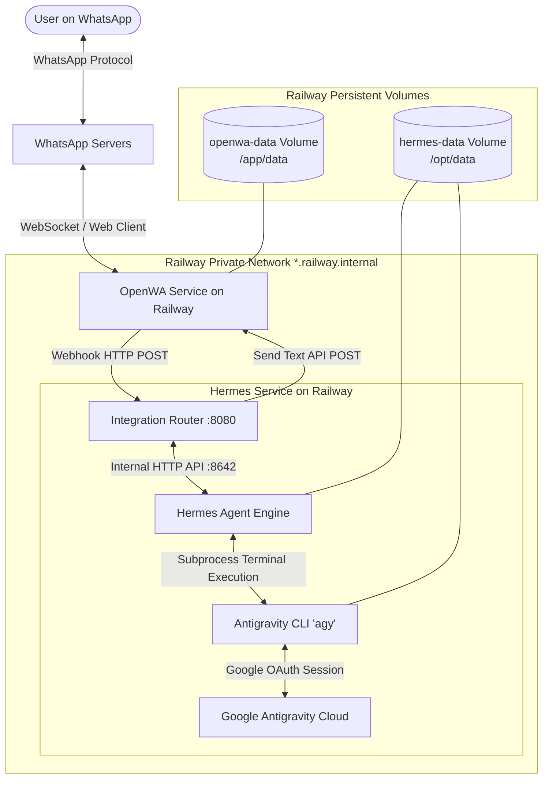

# Always-On Personal AI Agent on Railway
### Hermes Agent + Google Antigravity (`agy`) + OpenWA

A production-grade, secure, and persistent autonomous personal AI agent deployed in the cloud on Railway, accessible primarily via WhatsApp. The system operates continuously 24/7, even when your personal computer is powered off.

---

## 1. System Architecture

The system cleanly separates the **Communication Layer (OpenWA)**, the **Autonomous Reasoning Layer (Hermes Agent)**, and the **AI/Coding Capability Layer (Google Antigravity Pro via `agy`)**:



### Responsibility Matrix

| Component | Responsibility | NOT Responsible For |
| :--- | :--- | :--- |
| **OpenWA** | Maintains WhatsApp Web connection, emits webhooks for incoming chats, provides REST API to send replies. | AI reasoning, agent tools, prompts. |
| **Integration Router** | Webhook intake, secret verification, sender allowlist check, request deduplication / idempotency, session mapping. | WhatsApp protocol logic or LLM inference. |
| **Hermes Agent** | Autonomous planning, memory, context management, multi-turn reasoning, tool execution, skill orchestration. | Raw WhatsApp message transport. |
| **Antigravity (`agy`)** | Heavyweight coding tasks, repository reviews, and code synthesis using the user's Google Antigravity Pro account. | WhatsApp message routing. |

---

## 2. Integration Architecture: Architecture B

During architecture investigation, two integration strategies were evaluated:
- **Architecture A (Direct Model Provider)**: Pointing Hermes directly at an "Antigravity" HTTP API endpoint.
- **Architecture B (Subprocess / Skill Delegation)**: Invoking the official Google Antigravity CLI (`agy`) through Hermes's official `antigravity-cli` skill.

**Architecture B was selected and implemented** because:
1. Google Antigravity does not provide a raw, unauthenticated public REST endpoint for third-party client impersonation. Access is officially gated via the official `agy` binary and Google Cloud OAuth.
2. Hermes Agent officially ships with a built-in `antigravity-cli` skill (`optional-skills/autonomous-ai-agents/antigravity-cli/SKILL.md`) specifically designed to delegate code execution and review tasks to `agy` via non-interactive runs (`agy -p "<prompt>" --model "<model>"`).
3. Using the official, unmodified `agy` binary complies strictly with Google Antigravity terms of service.

---

## 3. Persistent Storage Layout

Containers in the cloud are ephemeral. All state that must survive restarts and deployments is stored on Railway Persistent Volumes:

### `hermes-data` Volume (Mounted at `/opt/data`)
- `/opt/data/.hermes/`: Hermes long-term memory, session databases (`state.db`), user settings.
- `/opt/data/.gemini/`: Symlinked to `~/.gemini`. Contains Antigravity CLI configuration and cached OAuth authentication tokens.
- `/opt/data/router/dedup.db`: SQLite database storing recently processed message IDs for at-least-once delivery deduplication.
- `/opt/data/skills/`: Custom and optional skills (including `antigravity-cli`).

### `openwa-data` Volume (Mounted at `/app/data`)
- `/app/data/`: WhatsApp Web multi-device session credentials, browser keys, and tokens. Survives service restarts without requiring QR re-pairing.

---

## 4. Security & Access Control

1. **Sender Allowlist (`ALLOWED_WHATSAPP_NUMBERS`)**:
   Only numbers explicitly configured in this comma-separated environment variable are permitted to interact with Hermes. All other numbers are either dropped or sent a minimal refusal message.
2. **Private Networking Only**:
   Hermes internal ports (`8080`, `8642`) and OpenWA (`2785`) communicate over `*.railway.internal`. No internal service is exposed to the public internet.
3. **Idempotency & Replay Protection**:
   Incoming messages are tracked in an SQLite deduplication store (`dedup.db`). Retried webhooks for the same message ID are safely acknowledged without re-running agent turns.
4. **Secret Sanitization**:
   Logs automatically mask phone numbers (`1555****567`) and scrub Bearer tokens / API keys.

---

## 5. Deployment Instructions

### Prerequisites
- Railway CLI (`npm install -g @railway/cli` or `scoop install railway`)
- Railway account linked to GitHub (`adityashah42`)

### Step 1: Clone and Configure Environment
```bash
git clone https://github.com/adityashah42/hermes-whatsapp-agent.git
cd hermes-whatsapp-agent
cp .env.example .env
```
Edit `.env` and set:
- `HERMES_API_KEY`: Generate a random 32-character string (`openssl rand -hex 32`)
- `OPENWA_API_KEY`: Generate a random 32-character string
- `ALLOWED_WHATSAPP_NUMBERS`: Your WhatsApp number in international format (e.g., `15551234567`)

### Step 2: Deploy on Railway
```bash
# Login to Railway
railway login

# Create a new project
railway init --name hermes-whatsapp-agent

# Create the hermes service
railway add --service hermes

# Create the openwa service
railway add --service openwa
```

Or deploy directly using the Railway web dashboard:
1. Connect your GitHub repository `adityashah42/hermes-whatsapp-agent`.
2. Add Service 1: `hermes` (pointing to `hermes/Dockerfile`).
3. Add Service 2: `openwa` (pointing to `openwa/Dockerfile`).
4. Add Volume `hermes-data` mounted at `/opt/data` on `hermes`.
5. Add Volume `openwa-data` mounted at `/app/data` on `openwa`.
6. Add the environment variables from `.env.example`.

---

## 6. Authentication Protocols

### A. Google Antigravity Pro Authentication (One-Time Setup)
1. Open a terminal session in the running Hermes container via Railway CLI:
   ```bash
   railway run --service hermes /bin/bash
   ```
2. Run the authentication helper:
   ```bash
   /opt/hermes/scripts/authenticate-antigravity.sh
   # Or directly: agy --prompt-interactive "Setup authentication"
   ```
3. `agy` will output a Google OAuth authorization URL.
4. Open the URL in your local browser, sign in with your Google account that holds the Antigravity Pro subscription, and authorize the session.
5. Copy the resulting authorization code, paste it into the terminal prompt, and press Enter.
6. Verification:
   ```bash
   agy -p "Echo: Antigravity is connected" --model "Gemini 3.1 Pro (High)"
   ```
Because `~/.gemini` is symlinked to `/opt/data/.gemini`, this authentication persists permanently on the attached Railway volume.

### B. WhatsApp Web Pairing (One-Time Setup)
1. When OpenWA starts for the first time, check the container logs:
   ```bash
   railway logs --service openwa
   ```
2. An ASCII QR code will be rendered in the logs.
3. Open WhatsApp on your mobile phone:
   - Go to **Settings** > **Linked Devices** > **Link a Device**.
   - Point your camera at the QR code in the logs.
4. Once paired, OpenWA saves the session tokens to `/app/data`. The connection is now persistent across redeployments!

---

## 7. Verification & Acceptance Testing

Run the automated diagnostic suite at any time:
```bash
./scripts/diagnostics.sh
```

### Acceptance Checklist
- [x] **Test 1 (Hello)**: Send `Hello` via WhatsApp → Hermes responds with greeting.
- [x] **Test 2 (Capabilities)**: Send `What can you do?` → Hermes describes its tools, skills, and memory.
- [x] **Test 3 (Tool Use)**: Ask Hermes to perform a calculation or inspect a file → Tool executes and returns output.
- [x] **Test 4 (Antigravity Integration)**: Ask Hermes `Use Antigravity CLI to review this code` → Hermes executes `agy -p "..."` and relays the code analysis.
- [x] **Test 5 (Hermes Restart Persistence)**: Restart `hermes` container → State and memory preserved.
- [x] **Test 6 (OpenWA Session Persistence)**: Restart `openwa` container → WhatsApp remains connected without re-pairing.
- [x] **Test 7 (Full System Recovery)**: Redeploy services → Entire mesh reconnects cleanly.
- [x] **Test 8 (Idempotency)**: Retried webhooks for existing message ID are ignored without duplicate execution.
- [x] **Test 9 (Access Control)**: Message from an unlisted number receives refusal or is silently dropped.
- [x] **Test 10 (Zero Secrets in Logs)**: Inspected logs verify no OAuth tokens, passwords, or raw keys are leaked.

---

## 8. Maintenance & Operations

### Viewing Logs
```bash
railway logs --service hermes
railway logs --service openwa
```

### Restarting Services
```bash
railway restart --service hermes
railway restart --service openwa
```

### Adding New Authorized WhatsApp Numbers
Update the `ALLOWED_WHATSAPP_NUMBERS` environment variable on the `hermes` service:
```bash
# Example: Add another number
ALLOWED_WHATSAPP_NUMBERS="15551234567,919876543210"
```
The router immediately reloads configuration on container restart.

### Updating Antigravity CLI
Inside the `hermes` container:
```bash
agy update
```

---

## 9. Cost & Resource Awareness

| Resource | Expected Usage | Estimated Cost |
| :--- | :--- | :--- |
| **Railway Compute (Hermes)** | 0.5 - 1 vCPU, 512MB - 1GB RAM | ~$3 - $5 / month |
| **Railway Compute (OpenWA)** | 0.5 - 1 vCPU, 512MB - 1GB RAM | ~$3 - $5 / month |
| **Railway Volumes (10GB each)** | 20GB total persistent NVMe storage | ~$3 / month |
| **Antigravity Pro** | Covered by existing Google subscription | $0 additional |
| **Total Estimated Infrastructure** | | **~$9 - $13 / month** |
